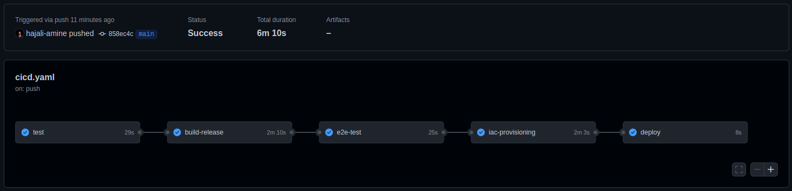
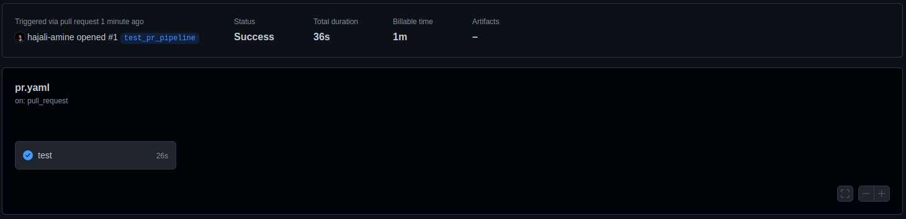

# Image Resizer

## Introduction

This project is my submission for our __DevOps & Software Testing__'s workshop at INSAT.

We were required to come up with a project, implement its Unit Tests, Integration Tests and E2E tests, then implement a CI/CD pipeline.

## Project

The project is a simple Spring Boot application that communicates with an AWS S3 bucket.

Through `POST /uploadImage`, an image that you embed to the body of the request through `image` key will be resized and saved in an S3 bucket.

Through `GET /getImage/{image}`, `image` being the name of the image that you sent, you can get back your picture.

The project requires two environment variables; *AWS_ACCESS_KEY* and *AWS_SECRET_KEY* to be able to connect to the S3 bucket.

## Tests

### Unit Tests

Click [here](./src/test/java/devops/workshop/photocompressor/UnitTests/) to go to the Unit Tests.

To mock the calls to S3, I used __Mockito__, a framework that allows the creation of test double objects (mock objects) in automated unit tests for the purpose of test-driven development (TDD) or behavior-driven development (BDD).

``` java
@Mock
AmazonS3 s3;

@Rule
public MockitoRule rule = MockitoJUnit.rule();

@Autowired
@Mock
private ImageServiceS3 imageServiceS3;

@Before
public void setUp() {
    MockitoAnnotations.openMocks(this);
    ReflectionTestUtils.setField(imageServiceS3, // inject into this object
            "property", // assign to this field
            "value"); // object to be injected
}

@Test
public void uploadFileFromMultipartFileTestCase() throws IOException {
    Mockito.when(s3.putObject(anyString(), anyString(), anyString())).thenReturn(new PutObjectResult()); // Mock call to S3
    Mockito.when(imageServiceS3.getS3()).thenReturn(s3);
    BufferedImage bufferedImage = ImageIO.read(Paths.get(resourcePath + "/test_image.jpg").toFile());
    Mockito.when(imageServiceS3.uploadImage(uploadedFileName, bufferedImage)).thenCallRealMethod(); // Call real method
    // rest of the test
}
```

### Integration Tests

In this part, we're going to test the interfaces, meaning everything related to the communication with S3 buckets.

For that, we are going to test the retrieval and upload on a _test bucket_, which is just another bucket not related to the one we use in the application.

You can find the tests [here](./src/test/java/devops/workshop/photocompressor/IntegrationTests/).

### E2E Tests

As for the E2E test, since we only have a backend project, I opted for a [__Python script__](./e2e/) that tests the main workflow.

The script is the following:

1. Send `POST /uploadImage` with our test image.
1. Check that the response status is 200 and response message is clear.
1. Send `GET /getImage/testImage`.
1. Check that the image is retrieved correctly and that it had been resized.
1. Remove image from S3 to clear everything up.

To clear everything up, we use this method.

``` python
# Remove object from S3
def clean_up(s3):
    os.remove(TEMP_FILEPATH)
    b = boto3.Bucket(s3, BUCKET_NAME)
    k = boto3.Key(b)
    k.key = FILENAME
    b.delete_key(k)
```

## CI/CD Pipeline

### Dockerfile

As you can see in the Dockerfile, I opted for a __multi-stage build__.

- _Stage one:_
    1. Copy `pom.xml`;
    1. Install __maven dependencies__;
    1. Build `.jar` file.
- _Stage two:_
    1. Make the directories necessary for the project;
    1. Copy the `.jar` file from _Stage one_;
    1. Expose port and annouce env variables;
    1. Run the `.jar` file.

### Initial Deployment

First, we need to prepare the __EC2 instance__.

After provisioning the instance, we will SSH into it and prepare our __RSA keys__ via the following steps.

1. run `ssh-keygen -t rsa -m PEM`;
1. run `cat key.pub >> authorized_keys`;
1. run `cat key`, which is our private key and we copied it to the GitHub secrets.

We will also install Docker in it.

And we're all set.

### CI/CD Pipeline on Push in the Main Branch

1. __Tests:__ Run Unit Tests and Integration Tests.
1. __Build and Release:__ Build the Docker Image and push it to Dockerhub.
1. __E2E Tests:__ Run the python script.
1. __Deploy:__
    1. SSH into the EC2 instance.
    1. Kill the docker container that's currently running and remove it.
    1. Pull the new image.
    1. Run the new image.

<p align="center">
    
</p>

### CI Pipeline on Pull Request in any branch

A simple pipeline to run the __Unit Tests__ and __Integration Tests__.

<p align="center">
    
</p>

--------

### Thank you for your time and don't forget to leave a :star2: